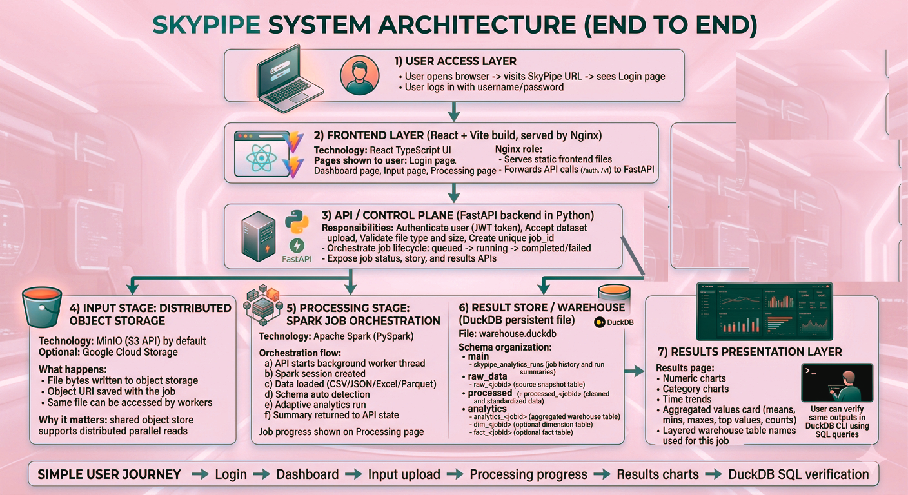
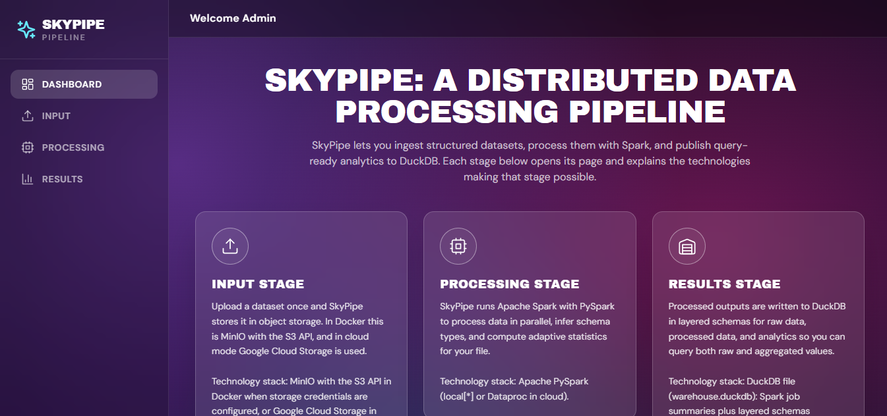
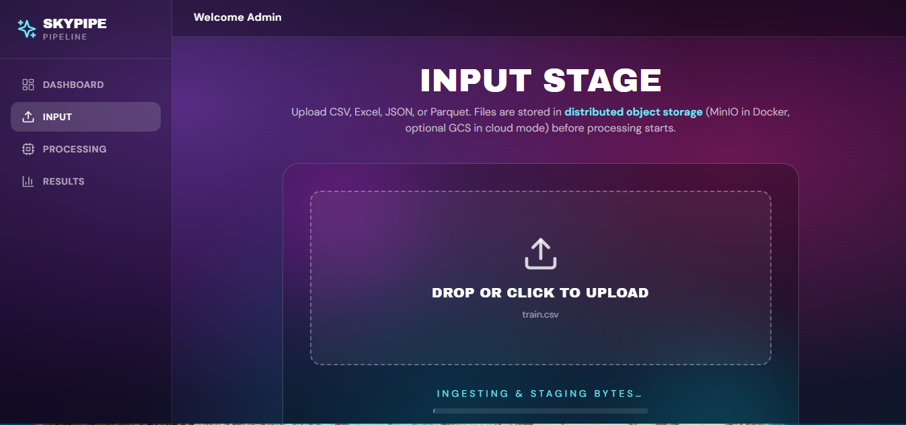
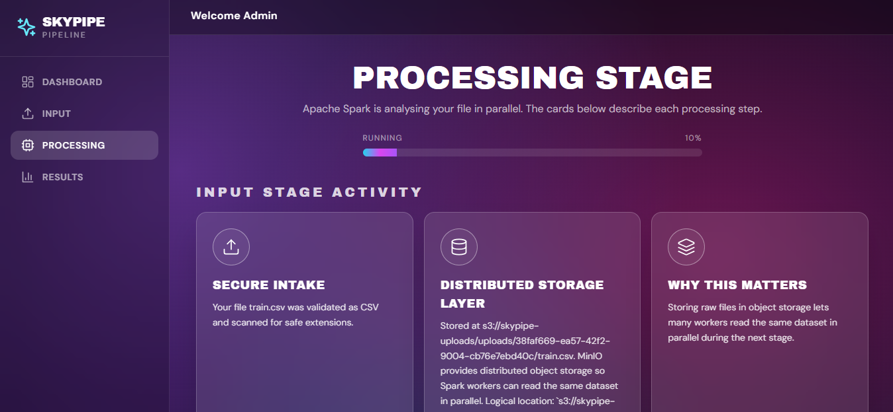
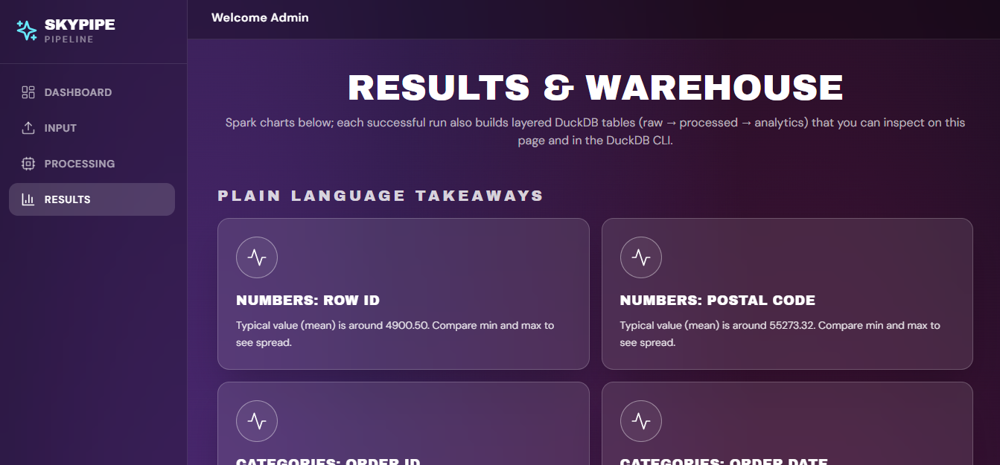

# SkyPipe: A Distributed Data Processing Pipeline

> **DSC3219 · Cloud and Distributed Computing Project Exam(UCU, Easter 2026)**  
> A complete, production ready pipeline that ingests multi format datasets, processes them in parallel with Spark, and stores analytics in a layered DuckDB warehouse.

Built by **Rugogamu Noela (S23B38/016, B22775)**

---


---

## Table of Contents

- [Executive Summary](#executive-summary)
- [Key Features](#key-features)
- [Architecture Overview](#architecture-overview)
- [Tech Stack](#tech-stack)
- [Quick Start / Installation](#quick-start--installation)
- [Usage Guide](#usage-guide)
- [Screenshots](#screenshots)
- [Scalability, Fault Tolerance \& Security](#scalability-fault-tolerance--security)
- [Project Structure](#project-structure)
- [Learning Outcomes \& Challenges Overcome](#learning-outcomes--challenges-overcome)
- [Future Enhancements](#future-enhancements)
- [Links](#links)
- [License \& Acknowledgments](#license--acknowledgments)

## Executive Summary

**SkyPipe** is a full distributed data processing pipeline. The system implements the required **3-stage architecture** end-to-end:

1. **Input Stage** - dataset upload and validation into distributed object storage (MinIO, S3-compatible).  
2. **Processing Stage** - adaptive parallel analytics using Apache Spark / PySpark.  
3. **Result Store Stage** - layered DuckDB warehouse (`raw_data -> processed -> analytics`) with queryable outputs and UI visualizations.

The platform supports **CSV, JSON, Excel, and Parquet**, includes JWT secured APIs, tracks real time job progress, and persists warehouse ready aggregates. It is designed to be both academically defensible and practically useful.

## Key Features

-  **Multi format ingestion**: CSV, JSON, XLSX/XLS, Parquet  
-  **Distributed object storage** via **MinIO (S3 API)**  
-  **Parallel Spark processing** with adaptive schema-aware analytics  
-  **Layered DuckDB warehouse**: `raw_data`, `processed`, `analytics`  
-  **Star schema generation** (dimension/fact tables) when grouping fields exist  
-  **Live processing UX**: upload -> progress -> results flow  
-  **Secure by default**: JWT auth, file validation, controlled storage access  
-  **Containerized deployment** with Docker Compose  
-  **Clear observability**: job states, metrics, and warehouse table mapping

## Architecture Overview

SkyPipe separates UI, API orchestration, distributed storage, parallel compute, and result warehousing to mirror real cloud data platforms. The frontend communicates with FastAPI through Nginx, uploads are staged in MinIO, Spark executes adaptive analytics, and outputs are persisted in DuckDB for immediate querying and dashboard use.

>  Architecture figure:  
> `docs/images/system_architecture.png`

```md

```

## Tech Stack

| Layer | Technology | Purpose |
|---|---|---|
| Frontend | React + TypeScript | User interface for login, upload, monitoring, and results |
| Web Gateway | Nginx | Static frontend serving + reverse proxy to backend |
| Backend API | FastAPI (Python) | Auth, upload intake, job orchestration, status/results APIs |
| Distributed Storage | MinIO (S3-compatible) | Input dataset storage for shared/parallel reads |
| Processing Engine | Apache Spark / PySpark | Parallel processing + adaptive analytics |
| Warehouse | DuckDB | Layered analytics storage (`raw_data`, `processed`, `analytics`) |
| Auth | JWT | Protected API access |
| DevOps | Docker Compose | Reproducible multi-service local deployment |

## Quick Start / Installation

### Prerequisites

- Docker + Docker Compose
- Git
- (Optional local dev) Python 3.10+ and Node.js 18+

### 1) Clone repository

```bash
git clone https://github.com/RUGOGAMUNOELA/cloud_computing_project.git
cd cloud_computing_project/skypipe
```

### 2) Start full stack (recommended)

```bash
docker compose up --build
```

### 3) Open services

- **UI:** `http://localhost:8080`
- **API Docs:** `http://localhost:8000/docs`
- **MinIO Console:** `http://localhost:9001` (default: `minioadmin / minioadmin`)

## Usage Guide

1. **Login**  
   Open SkyPipe and sign in with your configured credentials.

2. **Upload Dataset (Input Stage)**  
   Go to **Input** page and upload CSV/JSON/Excel/Parquet.  
   File is validated and staged to MinIO object storage.

3. **Monitor Processing (Processing Stage)**  
   Navigate to **Processing** page to watch real-time progress.  
   Spark detects schema and runs adaptive analytics in parallel.

4. **View Analytics (Result Store Stage)**  
   Open **Results** page for charts, aggregate values, and warehouse lineage.  
   Data is persisted in DuckDB layered schemas.

5. **Verify in DuckDB CLI (optional)**

```bash
duckdb "data/warehouse.duckdb"
```

```sql
SHOW SCHEMAS;
SELECT table_schema, table_name
FROM information_schema.tables
WHERE table_schema IN ('main','raw_data','processed','analytics')
ORDER BY table_schema, table_name;
```

## Screenshots

> Different UI images.

### Dashboard
`docs/images/dashboard.png`  


### Input Page
`docs/images/input_page.png`  


### Processing Page (Live Progress)
`docs/images/processing_page.png`  


### Results Page (Charts + Aggregates)
`docs/images/results_page.png`  


## Scalability, Fault Tolerance & Security

### Scalability

- Spark executes analytics in **parallel tasks** over partitioned data.
- Storage and compute are decoupled (object store + processing engine).
- Architecture can evolve from local mode to larger clustered execution patterns.

### Fault Tolerance

- Each upload receives a unique **job_id** and isolated lifecycle.
- Jobs transition through clear states: `queued -> running -> completed/failed`.
- Errors are captured safely without crashing the whole service.
- Processed outputs are persisted for replay/inspection in DuckDB.

### Security

- JWT protected backend endpoints.
- Upload validation (type, extension, size checks).
- Credentials sourced from environment variables, not hardcoded.
- Nginx gateway controls API route exposure.

## Project Structure

```text
skypipe/
├── frontend/                # React UI
├── src/                     # FastAPI + Spark + warehouse logic
│   ├── fastapi_app.py
│   ├── spark_pipeline.py
│   ├── schema_detector.py
│   ├── storage_pipeline.py
│   ├── warehouse_layers.py
│   └── warehouse_duckdb.py
├── docker/                  # Dockerfiles + nginx config
├── docs/                    # SRS,images, system design, concepts
├── report/                  # Project report
├── presentation/            # Project powerpoint slides
├── data/                    # Local persisted data (DuckDB, uploads)
├── docker-compose.yml
└── README.md
```

## Learning Outcomes & Challenges Overcome

This project strengthened practical understanding of distributed systems architecture, especially stage separation between storage, processing, and warehousing. It also improved skills in Spark orchestration, secure API development, and full stack integration for data workflows.

Key challenges included gateway timeouts during heavy processing, ensuring warehouse layers are always created per job, and keeping user-facing explanations clear. These were solved through backend job orchestration improvements, startup schema initialization, and UI/architecture refinements.

## Future Enhancements

- Cluster scale Spark deployment profile (e.g., managed cloud Spark)
- Role-based access control (RBAC) and audit logs
- Data quality rule engine for advanced validation
- Scheduled pipelines and recurring job triggers
- Exportable BI ready marts and semantic metric layer

## Links

- **GitHub Repository:** [RUGOGAMUNOELA/cloud_computing_project](https://github.com/RUGOGAMUNOELA/cloud_computing_project.git)
- **Technical Report (PDF):** `report/SKYPIPE_CLOUD_EXAM_REPORT.pdf`
- **Presentation Slides:** `presentation/SkyPipe_A Distributed Data Processing Pipeline.ppt`
- **Demo Video:** 

## License & Acknowledgments

This project was developed for academic purposes under **DSC3219 Cloud and Distributed Computing** at **Uganda Christian University** (Easter 2026).  
Special thanks to my course unit lecturer Mr.Ronald Ssejjuuko.
